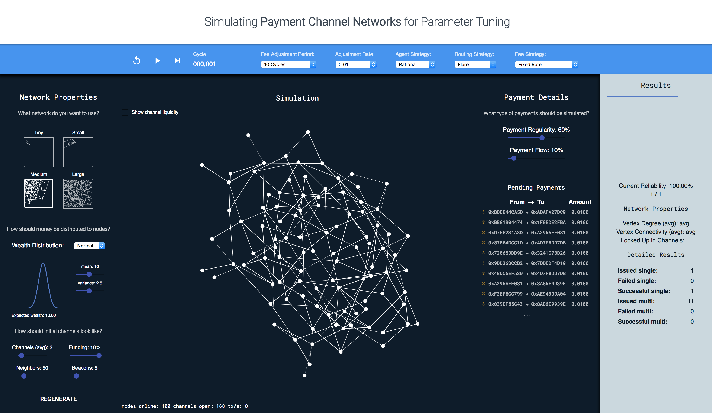

# README

## What is this?

*PCN Simulator* allows you to simulate payments in a payment channel network and observe occuring network changes. This includes changes in topology and liquidity, depending on the behavior of nodes, as well as various routing and protocol parameters. The next section will get you started!

The simulator in this repository is based on *octn-simulation* published by CSIRO that can be found in the [CSIRO Data Access Portal](http://hdl.handle.net/102.100.100/220996?index=1) ([original repository](https://bitbucket.csiro.au/projects/AAPDEVBC/repos/octn-simulation)).

## Getting Started

System Requirements:
 * npm
 * IntelliJ / Eclipse
 * [Kotlin Plugin](https://kotlinlang.org/docs/tutorials/getting-started.html) for IntelliJ / [Kotlin Plugin](https://kotlinlang.org/docs/tutorials/getting-started-eclipse.html) for Eclipse
 * *Optional:* Docker
 
To get started, import the project as a Gradle project into your Java IDE. Alternatively, you can use the Gradle wrapper
provided in the project. The first execution of `gradlew` on Linux and macOS or `gradlew.bat` on Windows will install
the correct version of Gradle for local use within the project.

## Build

To build the project, follow these steps:

1. **Install frontend dependencies**: In the directory `src/main/resources/public` run `npm install`
2. **Build the frontend**: In the directory `src/main/resources/public` run `npm run build`
3. **Create a jar**: In the project root directory, run `./gradlew jar`
4. **Create code documentation**: In the project root directory, run `./gradlew dokka`
5. **Build a Docker image**: In the project root directory, run `docker build -t pcn-simulator:0.2.0 .`

## Run

**Run in IDE:** To run the app in your IDE. The program entry point is located in the `Main.kt` class.

**Run container**: To run a Docker container, type `docker run -p 8081:8081 pcn-simulator:0.2.0`. For both cases, the tool is will now be available at [http://127.0.0.1:8081](http://127.0.0.1:8081).

## License

Refer to LICENSE.txt

## Authors

* Rafael Konlechner
* David Lobmaier (dlob)
